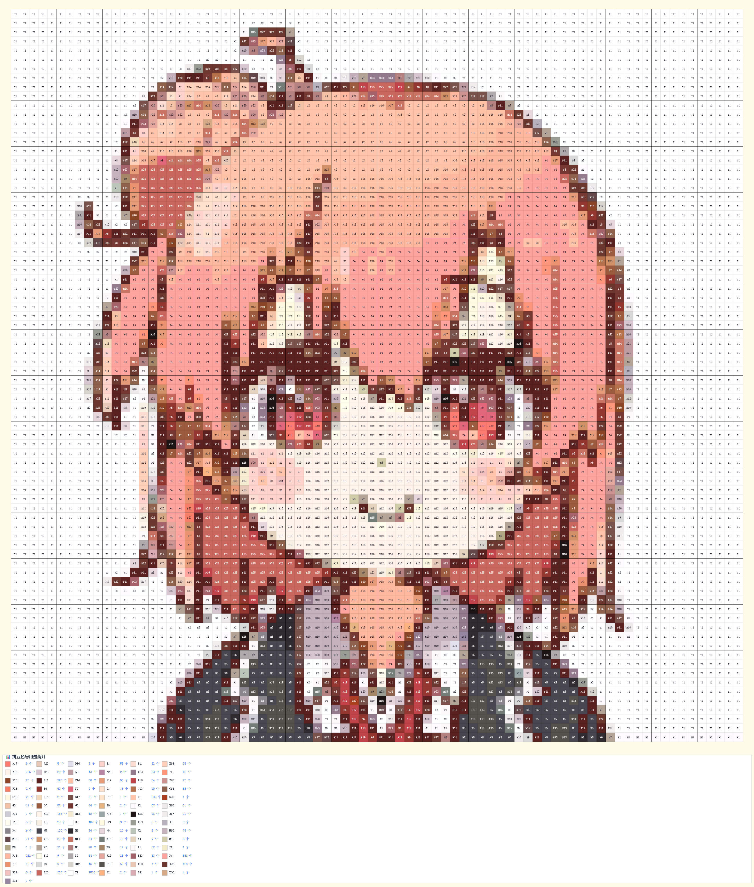

# PinDou-pattern-generator
自用拼豆图纸生成html

这是一个自制的拼豆图纸生成工具，来源于某一天的心血来潮，很简单的代码，下面是大概使用方法

<h3 style="">导入图片前：</h3> 
1、导入图片时会让你选择两次（小bug懒得深究了），请不要见怪，也请两次都选择同一张。 
2、工具对导入的图片没有剪裁处理，推荐自己将图片剪裁为1：1的正方形（最推荐）或其他比例。 
<h3>导入图片后：</h3> 
1、拼豆图纸行数列数的选择可能会有卡顿请耐心稍等一小会 
2、显示缩放功能是为了解决行列数较大是块内色号看不清，看不清楚的话请将系数调大一点哦（页面显示可能还是看不清，不过最终下载的肯定能看清的哦） 

<h4>
下面是效果示意（由比滨结衣）
</h4>
      参数： 80*80，缩放系数：2.20，未使用自定义编辑功能

